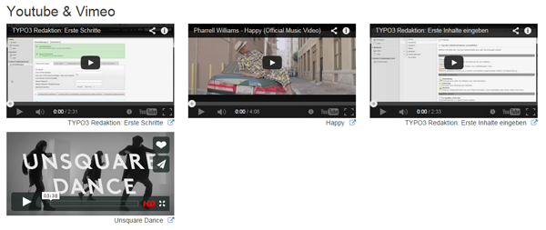

..  Editor configuration
	...................................................
	* utf-8 with BOM as encoding
	* tab indent with 4 characters for code snippet.
	* optional: soft carriage return preferred.

.. Includes roles, substitutions, ...
.. include:: _IncludedDirectives.rst

=================
Extension Name
=================

:Extension name: Video CE
:Extension key: videoce
:Version: 0.5.0
:Description: manuals covering TYPO3 extension "videoce"
:Language: en
:Author: Pascal Mayer
:Creation: 2014-07-28
:Generation: 23:09
:Licence: Open Content License available from `www.opencontent.org/opl.shtml <http://www.opencontent.org/opl.shtml>`_

The content of this document is related to TYPO3, a GNU/GPL CMS/Framework available from `www.typo3.org
<http://www.typo3.org/>`_

**Table of Contents**

.. toctree::
	:maxdepth: 2

	UserManual
	AdministratorManual

What does it do?
=================

Another content element for displaying Youtube and Vimeo videos.

		Screenshot of output.
		
		Screenshot with 4 videos displayed in 3 columns.
