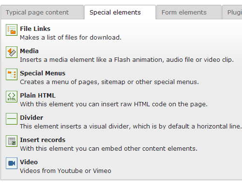
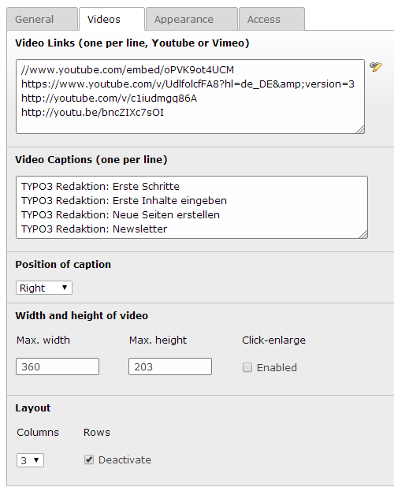

============
Users manual
============

Target group: **Editors**

Insert a video content element on a page.

		Icon/link to insert a video content element.

		The new video element is shown in the special elements group.

		
Add the video links and optional captions. The default layout to display columns uses bootstrap markup.

		Video content element fields

		Multiple youtube link formats are supported. Informations about vimeo video links will be retrieved via vimeo api call.